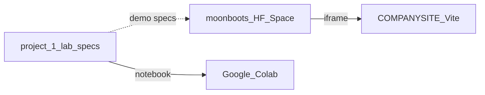

# LLM Playground — HF Space developer guide

This repo is the **hosted Gradio app** for interactive portfolio demos. Open this file in Cursor (`@DEVELOPER.md`) when implementing `app.py`.

| | |
|---|---|
| **Space** | [moonbootspleb/moonboots](https://huggingface.co/spaces/moonbootspleb/moonboots) |
| **Public URL** | https://huggingface.co/spaces/moonbootspleb/moonboots |
| **SDK** | Gradio on CPU (free tier) |
| **Source in GitHub** | `demos-1/moonboots/` in [llm_playground](https://github.com/moonbootspleb/llm_playground) |

---

## What this repo is (and is not)

**This repo:**

- Runs **all** interactive demos in **one** Gradio app (multiple tabs).
- Is what you `git push` to `git@hf.co:spaces/moonbootspleb/moonboots`.
- Is what [moonboots.tech](https://moonboots.tech) will embed later via iframe.

**This repo is not:**

- The course lab notebook ([`llm_playground.ipynb`](../llm_playground.ipynb)).
- The marketing site ([`COMPANYSITE`](../../../moonboots/COMPANYSITE) — Vite/React only, no PyTorch).
- A training data pipeline (no scrape, no fine-tuning here).

---

## Three-repo map



| Repo | Path on disk | You edit |
|------|----------------|----------|
| **This folder (Space)** | `demos-1/moonboots/` in [llm_playground](https://github.com/moonbootspleb/llm_playground) | `app.py`, `requirements.txt`, push to HF |
| **Lab** | This repo (root) | `llm_playground.ipynb`, `portfolio/demos/*.md` |
| **Site** | `moonboots/COMPANYSITE` | React + `VITE_LLM_PLAYGROUND_SPACE_URL` (later) |

**Cloud-only workflow:** You do not need local conda/Jupyter. Develop by pushing to this Space (or using the HF web editor). Use **Google Colab** for the full notebook exercises in parallel.

---

## What you do not need

- Local `environment.yaml` / `uv venv` on your Mac (optional only).
- Wookieepedia or any corpus scrape (saved for a future **RAG** demo).
- PyTorch or Gradio inside COMPANYSITE.
- A separate Hugging Face Space per demo.

---

## SSH and git

### SSH key (same as GitHub is fine)

1. Print your **public** key (never upload the private key):

   ```bash
   cat ~/.ssh/id_ed25519.pub
   # or: cat ~/.ssh/id_rsa.pub
   ```

2. Add it at [Hugging Face SSH settings](https://huggingface.co/settings/keys).

3. HF supports `ssh-ed25519`, `ssh-rsa`, `ecdsa-sha2-nistp256`, etc. It does **not** support FIDO/hardware keys like `sk-ssh-ed25519@openssh.com`. If GitHub uses only a security key, generate a normal key:

   ```bash
   ssh-keygen -t ed25519 -C "your@email" -f ~/.ssh/id_ed25519
   ```

4. Test:

   ```bash
   ssh -T git@hf.co
   ```

### Clone (if starting fresh)

```bash
git clone git@hf.co:spaces/moonbootspleb/moonboots
cd moonboots
```

### Deploy loop

Every change that should go live:

```bash
git add app.py requirements.txt DEVELOPER.md
git commit -m "Short description of change"
git push
```

HF rebuilds the Space automatically. Watch the **Logs** tab on the Space page if the build fails.

**Alternative:** Edit `app.py` in the Hugging Face Space web UI (Files tab) without cloning.

---

## Files in this repo

```text
moonboots/
  README.md           # HF Hub card metadata (YAML frontmatter) — keep short
  DEVELOPER.md         # This guide
  app.py              # Gradio app (you add this)
  theme.py            # MoonBoots theme + CSS (matches COMPANYSITE DESIGN.md)
  requirements.txt    # Python deps (you add this)
```

### `requirements.txt` (starter)

Create this file and commit before expecting a real app build:

```text
torch>=2.10.0
transformers>=5.1.0
tiktoken>=0.12.0
gradio>=5.0.0
```

Versions can match the lab: see [`requirements.txt`](../requirements.txt).

### `app.py` (structure)

Use one `gr.Blocks()` with tabs. Load heavy assets **once** at import time:

| Tab | Loads | Lab section | Spec |
|-----|--------|-------------|------|
| **Tokens** | `AutoTokenizer` + `tiktoken` only (no full GPT-2 weights) | §1.3–1.4 | [tokenizer-explorer.md](../portfolio/demos/tokenizer-explorer.md) |
| **NextToken** | GPT-2 + one forward pass | §2.3 | [next-token-microscope.md](../portfolio/demos/next-token-microscope.md) |
| **Decoding** | GPT-2 + `generate()` greedy vs top-p | §3.1–3.2 | [greedy-vs-top-p.md](../portfolio/demos/greedy-vs-top-p.md) |
| **Playground** | GPT-2 + unified UI | §5 | [decoding-playground.md](../portfolio/demos/decoding-playground.md) |

Skeleton:

```python
import gradio as gr

# Lazy or eager loads per tab — at minimum share one GPT-2 model for NextToken, Decoding, Playground.

with gr.Blocks(title="LLM Playground") as demo:
    with gr.Tabs():
        with gr.Tab("Tokens"):
            ...
        with gr.Tab("NextToken"):
            ...
        with gr.Tab("Decoding"):
            ...
        with gr.Tab("Playground"):
            ...

demo.launch()
```

**Portfolio embed:** One iframe URL points at this Space; visitors switch tabs inside Gradio. Do not create three separate iframes (triple cold start).

**Company site:** [moonboots.tech](https://moonboots.tech) lazy-loads the embed (scroll-near or explicit load) and unmounts when far off-screen. On the **Tokens** tab, tokenization runs on **Tokenize** / `demo.load` / Examples—not on every `Textbox` keystroke (`tok_inp.change` removed for CPU). Redeploy this Space after changing `app.py` so production matches.

---

## Build order (checklist)

Copy this list into your notes and check off as you go:

1. [ ] SSH key added on HF; `ssh -T git@hf.co` succeeds
2. [ ] `git push` to `moonbootspleb/moonboots` works
3. [ ] `requirements.txt` committed; Space build is green
4. [x] **Tokens** tab works (Milestone 1 below)
5. [x] **NextToken** tab — top-5 next tokens + HTML probability bars
6. [x] **Decoding** tab — same prompt, greedy vs top-p
7. [x] **Playground** tab — unified `generate()` UI
8. [ ] Space URL copied into COMPANYSITE `VITE_LLM_PLAYGROUND_SPACE_URL` when the project page exists

---

## Milestone 1 — Tokens tab (start here)

No full language model download required—fastest first win.

### Core logic

```python
from transformers import AutoTokenizer
import tiktoken

_hf_tok = AutoTokenizer.from_pretrained("gpt2")
_tik_gpt2 = tiktoken.get_encoding("gpt2")
# optional: _tik_cl100k = tiktoken.get_encoding("cl100k_base")


def tokenize_compare(text: str) -> str:
    if not text.strip():
        return "Enter some text."

    hf_ids = _hf_tok.encode(text)
    hf_tokens = _hf_tok.convert_ids_to_tokens(hf_ids)

    tik_ids = _tik_gpt2.encode(text)
    tik_tokens = [_tik_gpt2.decode([i]) for i in tik_ids]

    lines = [
        f"**HF GPT-2 BPE** — {len(hf_tokens)} tokens",
        " · ".join(f"`{t}`" for t in hf_tokens),
        "",
        f"**tiktoken gpt2** — {len(tik_tokens)} tokens",
        " · ".join(f"`{t}`" for t in tik_tokens),
    ]
    return "\n".join(lines)
```

### Gradio wiring

Use `gr.HTML` for color-coded chips; see `analyze_text()` + `render_token_explorer()` in `app.py`.

```python
with gr.Tab("Tokens"):
    inp = gr.Textbox(label="Text", lines=3, value="The 🌟 star-programmer implemented AGI overnight.")
    out = gr.HTML()
    btn = gr.Button("Tokenize", variant="primary")
    btn.click(tokenize_compare, inputs=inp, outputs=out)
    inp.change(tokenize_compare, inputs=inp, outputs=out)
    demo.load(tokenize_compare, inputs=inp, outputs=out)
    gr.Examples(examples=TOKEN_EXAMPLES, inputs=inp)  # four presets
```

### Verify

- [x] Space builds after `requirements.txt` is added
- [x] Tokens tab shows different counts for emoji/code vs plain English
- [x] No OOM on CPU (tokenizer-only)

---

## Milestone 2+ (after lab sections)

### NextToken tab

- Default prompt: `"Hello my name"`
- `GPT2LMHeadModel.from_pretrained("gpt2")`, `model.eval()`
- Logits at last position → `softmax` → `topk` → markdown table or bar-style text
- Spec: [next-token-microscope.md](../portfolio/demos/next-token-microscope.md)

### Decoding tab

- Same prompt → `generate(..., do_sample=False)` vs `do_sample=True, top_p=0.9`
- Presets: `Once upon a time`, `What is 2+2?`, `Suggest a party theme.`
- Spec: [greedy-vs-top-p.md](../portfolio/demos/greedy-vs-top-p.md)

### Playground tab

- Single `decode_text(prompt, strategy, max_new_tokens, top_p, temperature)` helper
- Spec: [decoding-playground.md](../portfolio/demos/decoding-playground.md)

### GPT-2 vs Qwen (not on this Space)

Instruction-tuned Qwen is heavy on free CPU. Use **Colab** for §4; on the portfolio site use static screenshots + Colab link.

- Spec: [gpt2-vs-qwen.md](../portfolio/demos/gpt2-vs-qwen.md)

---

## Parallel track: notebook on Colab

1. Open [Google Colab](https://colab.research.google.com/).
2. Upload or open [`llm_playground.ipynb`](../llm_playground.ipynb) from GitHub.
3. Install if needed: `pip install -q torch transformers tiktoken`
4. **Runtime → GPU** when you reach §4 (Qwen); CPU is OK for §1–§3 with GPT-2.

Colab and this Space share concepts and libraries; they are **different repos**.

---

## Demo spec index (lab repo)

Detailed UX, copy, and checklists live under `../portfolio/demos/`:

**Tier 1 — build on Space first**

- [tokenizer-explorer.md](../portfolio/demos/tokenizer-explorer.md)
- [next-token-microscope.md](../portfolio/demos/next-token-microscope.md)
- [greedy-vs-top-p.md](../portfolio/demos/greedy-vs-top-p.md)
- [gpt2-vs-qwen.md](../portfolio/demos/gpt2-vs-qwen.md) (Colab + static site)

**Tier 2**

- [tokenization-ladder.md](../portfolio/demos/tokenization-ladder.md)
- [parameter-scale-calculator.md](../portfolio/demos/parameter-scale-calculator.md)
- [transformer-block-diagram.md](../portfolio/demos/transformer-block-diagram.md)
- [decoding-playground.md](../portfolio/demos/decoding-playground.md)

**Tier 3**

- [pipeline-story.md](../portfolio/demos/pipeline-story.md)
- [demo-walkthrough-video.md](../portfolio/demos/demo-walkthrough-video.md)
- [failure-modes-gallery.md](../portfolio/demos/failure-modes-gallery.md)

Portfolio hub: [portfolio/README.md](../portfolio/README.md)

---

## COMPANYSITE (later)

When the project page exists on moonboots.tech:

```bash
# COMPANYSITE .env.example
VITE_LLM_PLAYGROUND_SPACE_URL=https://huggingface.co/spaces/moonbootspleb/moonboots
VITE_COLAB_NOTEBOOK_URL=<colab or github notebook url>
VITE_LLM_PLAYGROUND_GITHUB_URL=<project_1 github url>
```

Embed one iframe; tell visitors to open the **Tokens**, **NextToken**, or **Decoding** tab inside the Space.

Route (planned): `/work/llm-playground`

---

## Troubleshooting

| Issue | What to do |
|-------|------------|
| Space build failed | Open Logs on HF; fix `requirements.txt` (version conflicts, missing package). |
| Very slow first request | Normal: downloading GPT-2 weights. **Tokens** tab avoids that until you add model tabs. |
| `Permission denied (publickey)` | Add SSH public key to HF; use `git@hf.co` remote, not `github.com`. |
| Gradio shows old hello-world | Ensure `app.py` exists and `README.md` `app_file: app.py` matches; push committed files. |
| iframe blank on moonboots.tech | Set `VITE_LLM_PLAYGROUND_SPACE_URL`; Space must be **public**; redeploy Vercel. |
| Out of memory on CPU | Lower `max_new_tokens`; do not load Qwen on this Space. |

---

## Using this guide in Cursor

1. Open workspace folder: `demos-1/moonboots/` in the llm_playground repo (this folder).
2. Reference `@DEVELOPER.md` in chat when editing `app.py`.
3. Open the relevant spec under `project_1/portfolio/demos/` for the tab you are building.

---

## Deployment links (fill in when live)

| Resource | URL |
|----------|-----|
| This Space | https://huggingface.co/spaces/moonbootspleb/moonboots |
| Portfolio page | _TBD_ `https://moonboots.tech/work/llm-playground` |
| Colab notebook | _TBD_ |
| Lab GitHub | https://github.com/moonbootspleb/llm_playground |
