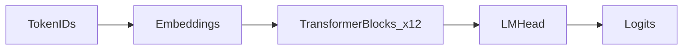

# Transformer block diagram

**Tier:** 2 | **Type:** Static SVG (COMPANYSITE) | **Status:** done

**Blog:** Part 3 · `#transformer-diagram`

## Overview

A clear **architecture diagram** of GPT-2: token embeddings → stacked Transformer blocks → language modeling head—with one block expanded to show attention and feed-forward.

## What visitors learn

An LLM is not a black box; it is a repeated stack of understandable pieces. The lab prints `model` and inspects `model.transformer.h[0]`—this demo turns that into a visual map for visitors who will not run the notebook.

## Connection to the lab

- [`llm_playground.ipynb`](../../llm_playground.ipynb) — **§2.1** Loading GPT-2, print architecture, inspect first Transformer block

## Demo behavior

1. **Static diagram** on portfolio (SVG, Figma export, or Mermaid in page):
   - Input IDs → **Token + position embeddings**
   - **N × Transformer block** (label: 12 layers for GPT-2 Small)
   - **LM head** → logits over vocabulary
2. **Expanded block** (inset or accordion):
   - Layer norm → multi-head self-attention → residual
   - Layer norm → MLP (feed-forward) → residual
3. Optional collapsible **code excerpt** from notebook: `print(model.transformer.h[0])` (screenshot or syntax-highlighted block).

## Visual design

- Left-to-right or top-to-bottom flow; match portfolio site typography/colors.
- Annotate tensor shapes at one point (e.g. `[batch, seq, hidden]`).
- Avoid overwhelming detail—no full 124M-parameter listing.
- Dark/light mode: export two SVGs or use CSS-friendly single-color line art.

## Copy suggestions

> In the lab I loaded GPT-2 and inspected layer zero. This diagram is the map: the model’s job is to turn a sequence of token embeddings into a probability distribution over the next token at each position.

> Attention mixes information between tokens; the feed-forward network transforms each position. Stack that twelve times and you have GPT-2 Small.

## Technical notes

- **No runtime inference** required—pure static asset.
- Source diagram from lab notes or tools (Excalidraw, draw.io, Mermaid).
- Mermaid example structure (for implementer):

- Keep in sync with `GPT2LMHeadModel` naming from `transformers`.

## Build checklist

- [ ] Create SVG diagram (embed + alt text for accessibility)
- [ ] Add expanded block inset with attention + FFN labels
- [ ] Screenshot `model.transformer.h[0]` from notebook for “under the hood” panel
- [ ] Place in Tier 2 section of portfolio page
- [ ] Link to notebook §2.1

## Status

`done` — `TransformerDiagram.tsx` on COMPANYSITE Part 3.
